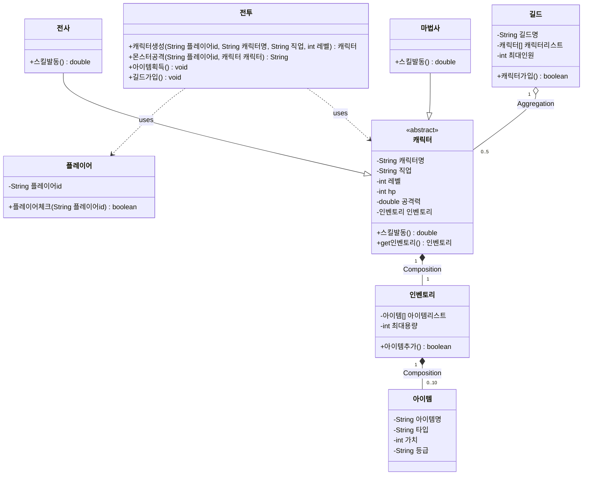

```mermaid
classDiagram
    class 플레이어 {
        -String 플레이어id
        +플레이어체크(String 플레이어id) boolean
    }

    class 전투 {
        +캐릭터생성(String 플레이어id, String 캐릭터명, String 직업, int 레벨) 캐릭터
        +몬스터공격(String 플레이어id, 캐릭터 캐릭터) String
        +아이템획득() void
        +길드가입() void
    }

    class 캐릭터 {
        <<abstract>>
        -String 캐릭터명
        -String 직업
        -int 레벨
        -int hp
        -double 공격력
        -인벤토리 인벤토리
        +스킬발동() double
        +get인벤토리() 인벤토리
    }

    class 전사 {
        +스킬발동() double
    }

    class 마법사 {
        +스킬발동() double
    }

    class 인벤토리 {
        -아이템[] 아이템리스트
        -int 최대용량
        +아이템추가() boolean
    }

    class 아이템 {
        -String 아이템명
        -String 타입
        -int 가치
        -String 등급
    }

    class 길드 {
        -String 길드명
        -캐릭터[] 캐릭터리스트
        -int 최대인원
        +캐릭터가입() boolean
    }

    전사 --|> 캐릭터
    마법사 --|> 캐릭터

    전투 ..> 플레이어 : uses
    전투 ..> 캐릭터 : uses

    캐릭터 "1" *-- "1" 인벤토리 : Composition
    인벤토리 "1" *-- "0..10" 아이템 : Composition
    길드 "1" o-- "0..5" 캐릭터 : Aggregation
```