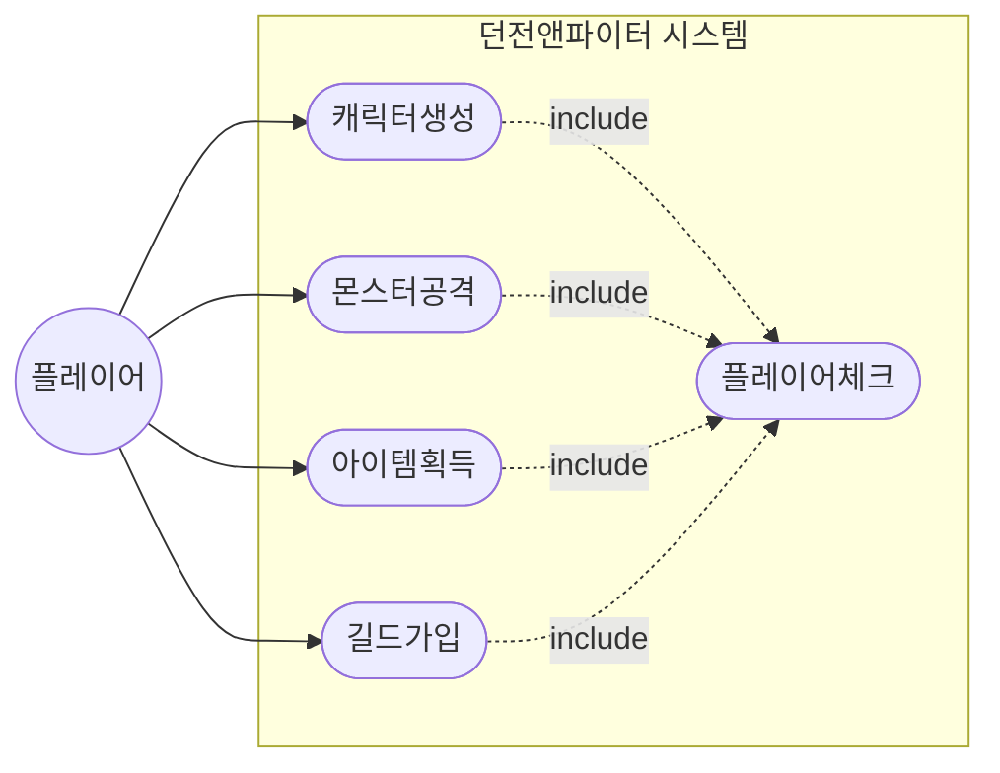

```mermaid
flowchart LR
    Player((플레이어))

    subgraph System[던전앤파이터 시스템]
        UC1([캐릭터생성])
        UC2([몬스터공격])
        UC3([아이템획득])
        UC4([길드가입])
        UC5([플레이어체크])
    end

    Player --> UC1
    Player --> UC2
    Player --> UC3
    Player --> UC4

    UC1 -. include .-> UC5
    UC2 -. include .-> UC5
    UC3 -. include .-> UC5
    UC4 -. include .-> UC5
```