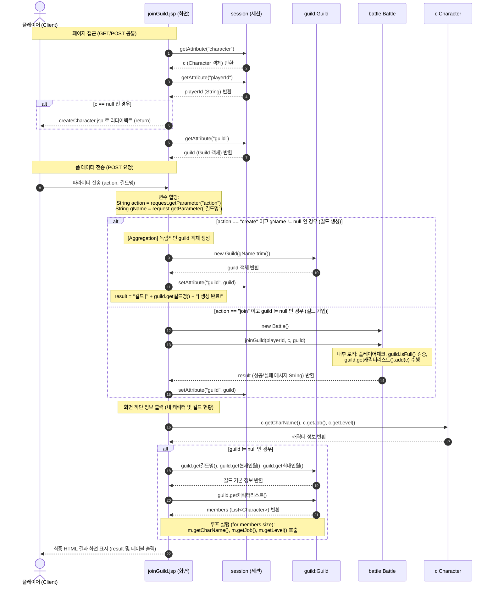

```mermaid
sequenceDiagram
    autonumber
    actor 플레이어 as 플레이어 (Client)
    participant 화면 as joinGuild.jsp (화면)
    participant 세션 as session (세션)
    participant 길드객체 as guild:Guild
    participant 전투객체 as battle:Battle
    participant 캐릭터객체 as c:Character

    %% 1. 세션 속성 조회 단계
    Note over 플레이어, 화면: 페이지 접근 (GET/POST 공통)
    화면->>세션: getAttribute("character")
    세션-->>화면: c (Character 객체) 반환
    화면->>세션: getAttribute("playerId")
    세션-->>화면: playerId (String) 반환
    
    alt c == null 인 경우
        화면-->>플레이어: createCharacter.jsp 로 리다이렉트 (return)
    end

    화면->>세션: getAttribute("guild")
    세션-->>화면: guild (Guild 객체) 반환

    %% 2. POST 요청 조건 분기
    Note over 플레이어, 화면: 폼 데이터 전송 (POST 요청)
    플레이어->>화면: 파라미터 전송 (action, 길드명)
    Note over 화면: 변수 할당:<br/>String action = request.getParameter("action")<br/>String gName = request.getParameter("길드명")

    alt action == "create" 이고 gName != null 인 경우 (길드 생성)
        Note over 화면: [Aggregation] 독립적인 guild 객체 생성
        화면->>길드객체: new Guild(gName.trim())
        길드객체-->>화면: guild 객체 반환
        화면->>세션: setAttribute("guild", guild)
        Note over 화면: result = "길드 [" + guild.get길드명() + "] 생성 완료!"

    else action == "join" 이고 guild != null 인 경우 (길드 가입)
        화면->>전투객체: new Battle()
        화면->>전투객체: joinGuild(playerId, c, guild)
        Note over 전투객체: 내부 로직: 플레이어체크, guild.isFull() 검증,<br/>guild.get캐릭터리스트().add(c) 수행
        전투객체-->>화면: result (성공/실패 메시지 String) 반환
        화면->>세션: setAttribute("guild", guild)
    end

    %% 3. 출력 및 갱신 화면 (Rendering)
    Note over 화면: 화면 하단 정보 출력 (내 캐릭터 및 길드 현황)
    화면->>캐릭터객체: c.getCharName(), c.getJob(), c.getLevel()
    캐릭터객체-->>화면: 캐릭터 정보 반환
    
    alt guild != null 인 경우
        화면->>길드객체: guild.get길드명(), guild.get현재인원(), guild.get최대인원()
        길드객체-->>화면: 길드 기본 정보 반환
        
        화면->>길드객체: guild.get캐릭터리스트()
        길드객체-->>화면: members (List<Character>) 반환
        
        Note over 화면, 길드객체: 루프 실행 (for members.size):<br/>m.getCharName(), m.getJob(), m.getLevel() 호출
    end

    화면-->>플레이어: 최종 HTML 결과 화면 표시 (result 및 테이블 출력)
```
