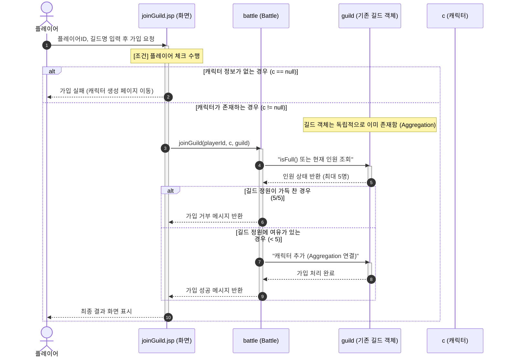

```mermaid
sequenceDiagram
    autonumber
    actor User as 플레이어
    participant JSP as joinGuild.jsp (화면)
    participant Battle as battle (Battle)
    participant Guild as guild (기존 길드 객체)
    participant Char as c (캐릭터)

    User->>JSP: 플레이어ID, 길드명 입력 후 가입 요청
    activate JSP

    %% 조건 1: 반드시 플레이어 체크를 한다.
    Note over JSP: [조건] 플레이어 체크 수행
    alt 캐릭터 정보가 없는 경우 (c == null)
        JSP-->>User: 가입 실패 (캐릭터 생성 페이지 이동)
    else 캐릭터가 존재하는 경우 (c != null)
        
        %% 조건 2: 길드는 이미 다른 곳에서 만들어진 객체이다.
        Note over Guild: 길드 객체는 독립적으로 이미 존재함 (Aggregation)

        JSP->>Battle: joinGuild(playerId, c, guild)
        activate Battle

        %% 조건 3: 길드 정원은 최대 5명이다. 가득 차면 가입 불가.
        Battle->>Guild: "isFull() 또는 현재 인원 조회"
        activate Guild
        Guild-->>Battle: 인원 상태 반환 (최대 5명)
        deactivate Guild

        alt 길드 정원이 가득 찬 경우 (5/5)
            Battle-->>JSP: 가입 거부 메시지 반환
        else 길드 정원에 여유가 있는 경우 (< 5)
            %% 조건 4: 캐릭터를 기존 길드에 가입시킨다 (참조 관계)
            Battle->>Guild: "캐릭터 추가 (Aggregation 연결)"
            activate Guild
            Guild-->>Battle: 가입 처리 완료
            deactivate Guild
            Battle-->>JSP: 가입 성공 메시지 반환
        end
        deactivate Battle

        JSP-->>User: 최종 결과 화면 표시
    end
    deactivate JSP
```
