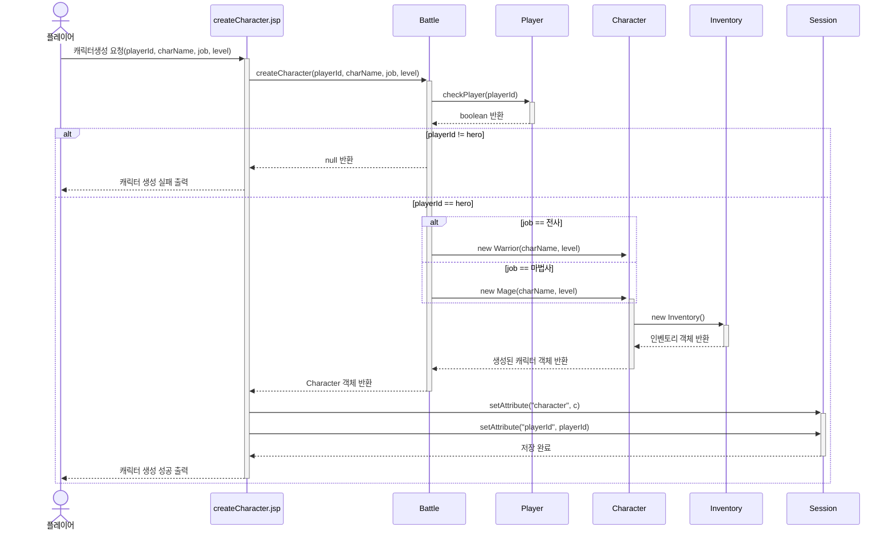

```mermaid
sequenceDiagram
    actor 플레이어

    participant 생성UI as createCharacter.jsp
    participant 전투 as Battle
    participant 플레이어객체 as Player
    participant 캐릭터 as Character
    participant 인벤토리 as Inventory
    participant 세션 as Session

    플레이어 ->>+ 생성UI: 캐릭터생성 요청(playerId, charName, job, level)
    생성UI ->>+ 전투: createCharacter(playerId, charName, job, level)

    전투 ->>+ 플레이어객체: checkPlayer(playerId)
    플레이어객체 -->>- 전투: boolean 반환

    alt playerId != hero
        전투 -->> 생성UI: null 반환
        생성UI -->> 플레이어: 캐릭터 생성 실패 출력

    else playerId == hero
        alt job == 전사
            전투 ->>+ 캐릭터: new Warrior(charName, level)
        else job == 마법사
            전투 ->>+ 캐릭터: new Mage(charName, level)
        end

        캐릭터 ->>+ 인벤토리: new Inventory()
        인벤토리 -->>- 캐릭터: 인벤토리 객체 반환


        캐릭터 -->>- 전투: 생성된 캐릭터 객체 반환
        전투 -->>- 생성UI: Character 객체 반환

        생성UI ->>+ 세션: setAttribute("character", c)
        생성UI ->> 세션: setAttribute("playerId", playerId)
        세션 -->>- 생성UI: 저장 완료

        생성UI -->>- 플레이어: 캐릭터 생성 성공 출력
    end
```