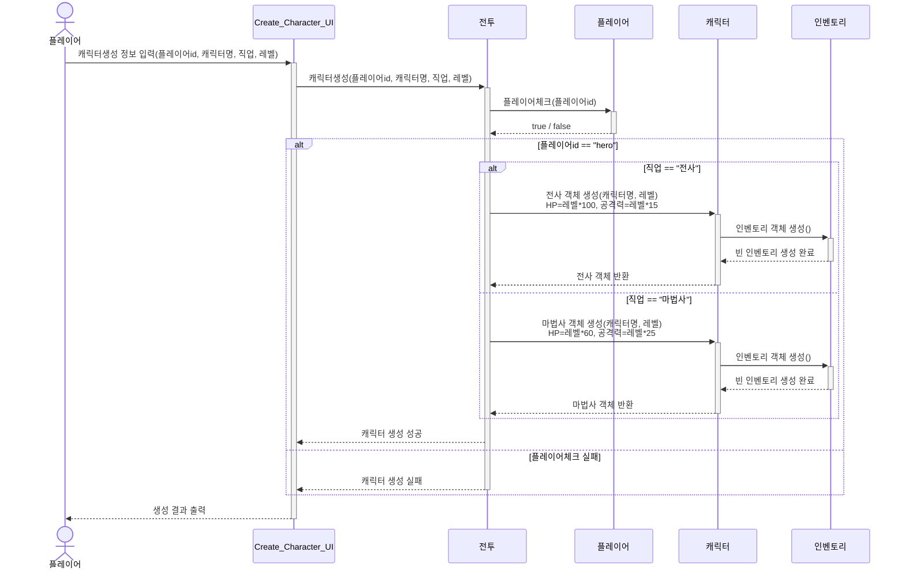

```mermaid
sequenceDiagram
    actor 플레이어
    participant Create_Character_UI
    participant 전투
    participant 플레이어객체 as 플레이어
    participant 캐릭터
    participant 인벤토리

    플레이어 ->>+ Create_Character_UI: 캐릭터생성 정보 입력(플레이어id, 캐릭터명, 직업, 레벨)
    Create_Character_UI ->>+ 전투: 캐릭터생성(플레이어id, 캐릭터명, 직업, 레벨)

    전투 ->>+ 플레이어객체: 플레이어체크(플레이어id)
    플레이어객체 -->>- 전투: true / false

    alt 플레이어id == "hero"
        alt 직업 == "전사"
            전투 ->>+ 캐릭터: 전사 객체 생성(캐릭터명, 레벨)<br/>HP=레벨*100, 공격력=레벨*15
            캐릭터 ->>+ 인벤토리: 인벤토리 객체 생성()
            인벤토리 -->>- 캐릭터: 빈 인벤토리 생성 완료
            캐릭터 -->>- 전투:  전사 객체 반환

        else 직업 == "마법사"
            전투 ->>+ 캐릭터: 마법사 객체 생성(캐릭터명, 레벨)<br/>HP=레벨*60, 공격력=레벨*25
            캐릭터 ->>+ 인벤토리: 인벤토리 객체 생성()
            인벤토리 -->>- 캐릭터: 빈 인벤토리 생성 완료
            캐릭터 -->>- 전투: 마법사 객체 반환
        end

        전투 -->> Create_Character_UI: 캐릭터 생성 성공
    else 플레이어체크 실패
        전투 -->>- Create_Character_UI: 캐릭터 생성 실패
    end

    Create_Character_UI -->>- 플레이어: 생성 결과 출력
```