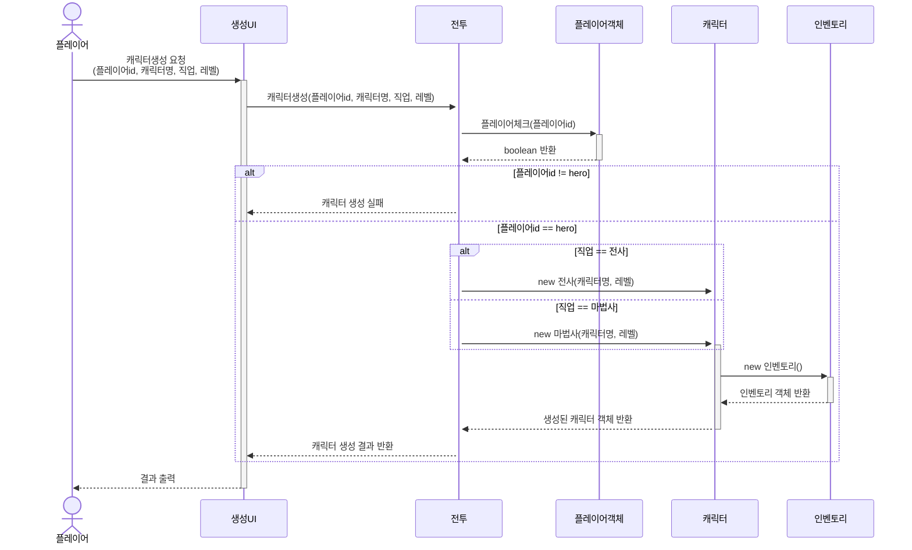

```mermaid
sequenceDiagram
    actor 플레이어

    participant 생성UI
    participant 전투
    participant 플레이어객체
    participant 캐릭터
    participant 인벤토리

    플레이어 ->>+ 생성UI: 캐릭터생성 요청<br/>(플레이어id, 캐릭터명, 직업, 레벨)

    생성UI ->>+ 전투: 캐릭터생성(플레이어id, 캐릭터명, 직업, 레벨)

    전투 ->>+ 플레이어객체: 플레이어체크(플레이어id)

    플레이어객체 -->>- 전투: boolean 반환

    alt 플레이어id != hero

        전투 -->> 생성UI: 캐릭터 생성 실패

    else 플레이어id == hero

        alt 직업 == 전사

            전투 ->>+ 캐릭터: new 전사(캐릭터명, 레벨)

        else 직업 == 마법사

            전투 ->>+ 캐릭터: new 마법사(캐릭터명, 레벨)

        end

        캐릭터 ->>+ 인벤토리: new 인벤토리()

        인벤토리 -->>- 캐릭터: 인벤토리 객체 반환


        캐릭터 -->>- 전투: 생성된 캐릭터 객체 반환

        전투 -->> 생성UI: 캐릭터 생성 결과 반환

    end

    생성UI -->>- 플레이어: 결과 출력
```