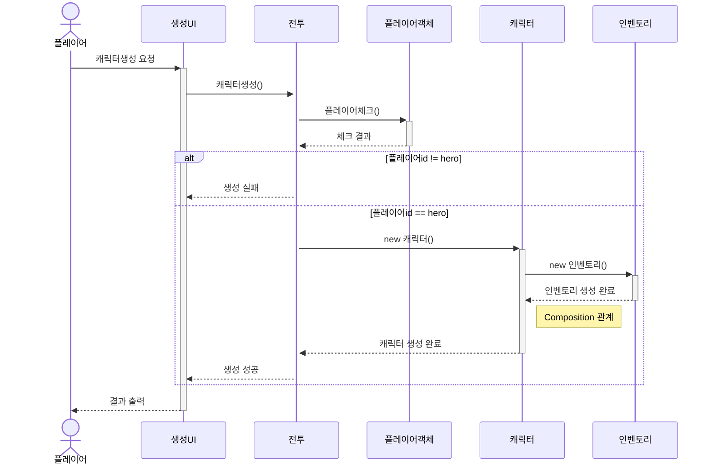

```mermaid
sequenceDiagram
    actor 플레이어

    participant 생성UI
    participant 전투
    participant 플레이어객체
    participant 캐릭터
    participant 인벤토리

    플레이어->>+생성UI: 캐릭터생성 요청

    생성UI->>+전투: 캐릭터생성()

    전투->>+플레이어객체: 플레이어체크()

    플레이어객체-->>-전투: 체크 결과

    alt 플레이어id != hero

        전투-->>생성UI: 생성 실패

    else 플레이어id == hero

        전투->>+캐릭터: new 캐릭터()

        캐릭터->>+인벤토리: new 인벤토리()

        인벤토리-->>-캐릭터: 인벤토리 생성 완료

        Note right of 캐릭터: Composition 관계

        캐릭터-->>-전투: 캐릭터 생성 완료

        전투-->>생성UI: 생성 성공

    end

    생성UI-->>-플레이어: 결과 출력
```