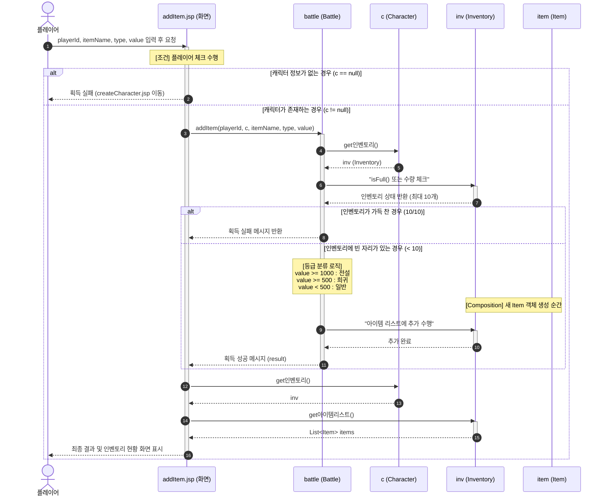

```mermaid
sequenceDiagram
    autonumber
    actor User as 플레이어
    participant JSP as addItem.jsp (화면)
    participant Battle as battle (Battle)
    participant Char as c (Character)
    participant Inv as inv (Inventory)
    participant Item as item (Item)

    User->>JSP: playerId, itemName, type, value 입력 후 요청
    activate JSP

    %% 조건 1: 반드시 플레이어 체크를 한다.
    Note over JSP: [조건] 플레이어 체크 수행
    alt 캐릭터 정보가 없는 경우 (c == null)
        JSP-->>User: 획득 실패 (createCharacter.jsp 이동)
    else 캐릭터가 존재하는 경우 (c != null)
        
        JSP->>Battle: addItem(playerId, c, itemName, type, value)
        activate Battle

        %% 조건 2: 인벤토리가 가득 차면 (10개) 아이템을 획득할 수 없다.
        Battle->>Char: get인벤토리()
        Char-->>Battle: inv (Inventory)
        
        Battle->>Inv: "isFull() 또는 수량 체크"
        activate Inv
        Inv-->>Battle: 인벤토리 상태 반환 (최대 10개)
        deactivate Inv

        alt 인벤토리가 가득 찬 경우 (10/10)
            Battle-->>JSP: 획득 실패 메시지 반환
        else 인벤토리에 빈 자리가 있는 경우 (< 10)
            
            %% 조건 3: 아이템 가치에 따라 등급을 부여한다.
            Note over Battle: [등급 분류 로직]<br/>value >= 1000 : 전설<br/>value >= 500 : 희귀<br/>value < 500 : 일반

            %% 조건 4: 캐릭터의 인벤토리에 아이템을 추가한다. (Composition)
            %% 인벤토리 내부에서 완전히 새롭게 종속적인 Item 객체를 생성함
            Note over Inv, Item: [Composition] 새 Item 객체 생성 순간
            Battle->>Inv: "아이템 리스트에 추가 수행"
            activate Inv
            Inv-->>Battle: 추가 완료
            deactivate Inv
            
            Battle-->>JSP: 획득 성공 메시지 (result)
        end
        deactivate Battle

        %% 최종 화면 렌더링을 위한 잔여 데이터 조회
        JSP->>Char: get인벤토리()
        Char-->>JSP: inv
        JSP->>Inv: get아이템리스트()
        activate Inv
        Inv-->>JSP: List<Item> items
        deactivate Inv

        JSP-->>User: 최종 결과 및 인벤토리 현황 화면 표시
    end
    deactivate JSP
```
