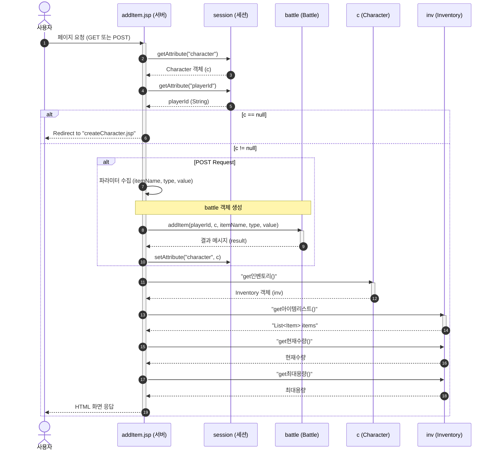

```mermaid
sequenceDiagram
    autonumber
    actor User as 사용자
    participant JSP as addItem.jsp (서버)
    participant Session as session (세션)
    participant Battle as battle (Battle)
    participant Char as c (Character)
    participant Inv as inv (Inventory)

    User->>JSP: 페이지 요청 (GET 또는 POST)
    activate JSP

    %% 1. 세션 데이터 조회
    JSP->>Session: getAttribute("character")
    Session-->>JSP: Character 객체 (c)
    JSP->>Session: getAttribute("playerId")
    Session-->>JSP: playerId (String)

    %% 2. 캐릭터 유효성 검사
    alt c == null
        JSP-->>User: Redirect to "createCharacter.jsp"
    else c != null
        
        %% 3. POST 요청 처리
        alt POST Request
            JSP->>JSP: 파라미터 수집 (itemName, type, value)
            
            %% create를 호출하기 전에 생성을 명시하거나, 상단 선언부와 호환되도록 처리
            Note over JSP, Battle: battle 객체 생성
            JSP->>Battle: addItem(playerId, c, itemName, type, value)
            activate Battle
            Battle-->>JSP: 결과 메시지 (result)
            deactivate Battle
            
            JSP->>Session: setAttribute("character", c)
        end

        %% 4. 인벤토리 및 아이템 리스트 조회
        JSP->>Char: "get인벤토리()"
        activate Char
        Char-->>JSP: Inventory 객체 (inv)
        deactivate Char

        JSP->>Inv: "get아이템리스트()"
        activate Inv
        Inv-->>JSP: "List<Item> items"
        deactivate Inv
        
        JSP->>Inv: "get현재수량()"
        Inv-->>JSP: 현재수량
        JSP->>Inv: "get최대용량()"
        Inv-->>JSP: 최대용량

        %% 5. 응답
        JSP-->>User: HTML 화면 응답
    end
    deactivate JSP
```
