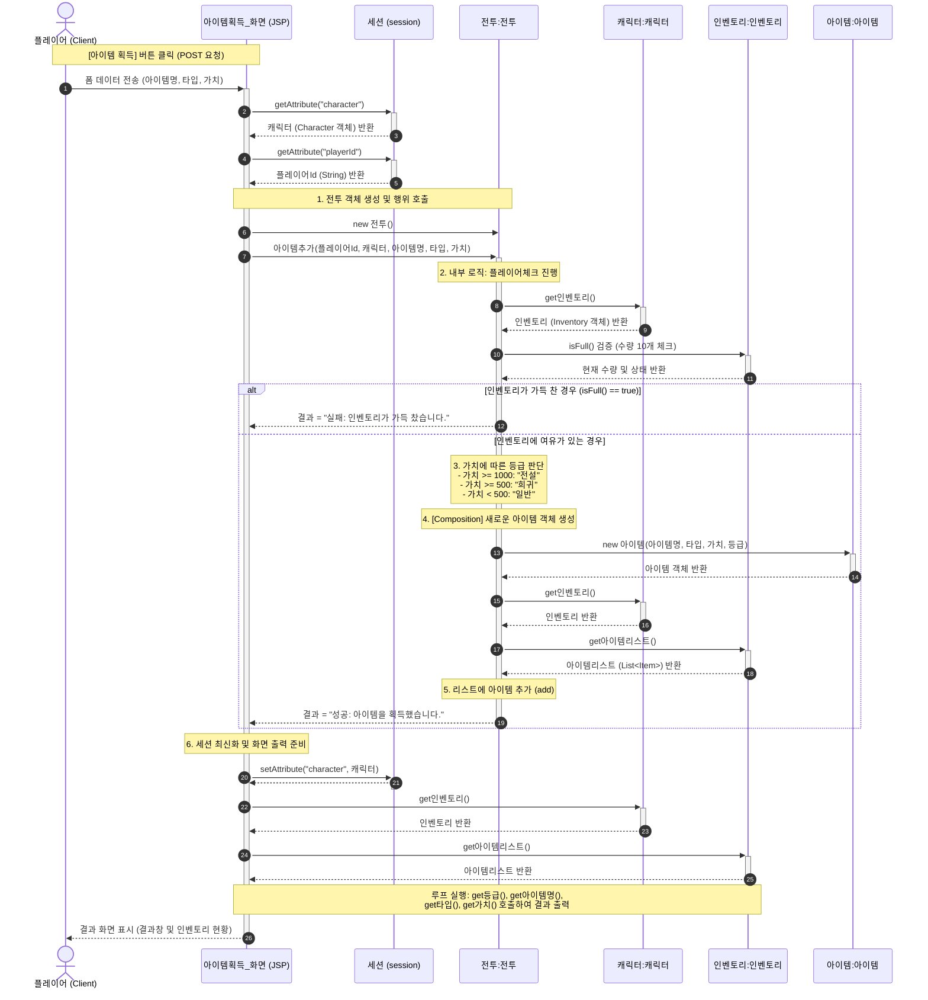

```mermaid
sequenceDiagram
    autonumber
    actor 플레이어 as 플레이어 (Client)
    participant 화면 as 아이템획득_화면 (JSP)
    participant 세션 as 세션 (session)
    participant 전투 as 전투:전투
    participant 캐릭터 as 캐릭터:캐릭터
    participant 인벤토리 as 인벤토리:인벤토리
    participant 아이템 as 아이템:아이템

    Note over 플레이어, 화면: [아이템 획득] 버튼 클릭 (POST 요청)
    플레이어->>+화면: 폼 데이터 전송 (아이템명, 타입, 가치)
    
    %% 세션 확인 단계
    화면->>+세션: getAttribute("character")
    세션-->>-화면: 캐릭터 (Character 객체) 반환
    화면->>+세션: getAttribute("playerId")
    세션-->>-화면: 플레이어Id (String) 반환

    %% 비즈니스 로직 시작
    Note over 화면, 전투: 1. 전투 객체 생성 및 행위 호출
    화면->>전투: new 전투()
    화면->>+전투: 아이템추가(플레이어Id, 캐릭터, 아이템명, 타입, 가치)
    
    %% 요구사항: 플레이어 체크 및 인벤토리 체크
    Note over 전투: 2. 내부 로직: 플레이어체크 진행
    전투->>+캐릭터: get인벤토리()
    캐릭터-->>-전투: 인벤토리 (Inventory 객체) 반환
    
    전투->>+인벤토리: isFull() 검증 (수량 10개 체크)
    인벤토리-->>-전투: 현재 수량 및 상태 반환
    
    alt 인벤토리가 가득 찬 경우 (isFull() == true)
        전투-->>화면: 결과 = "실패: 인벤토리가 가득 찼습니다."
    else 인벤토리에 여유가 있는 경우
        Note over 전투: 3. 가치에 따른 등급 판단<br/>- 가치 >= 1000: "전설"<br/>- 가치 >= 500: "희귀"<br/>- 가치 < 500: "일반"
        
        Note over 전투: 4. [Composition] 새로운 아이템 객체 생성
        전투->>+아이템: new 아이템(아이템명, 타입, 가치, 등급)
        아이템-->>-전투: 아이템 객체 반환
        
        전투->>+캐릭터: get인벤토리()
        캐릭터-->>-전투: 인벤토리 반환
        전투->>+인벤토리: get아이템리스트()
        인벤토리-->>-전투: 아이템리스트 (List<Item>) 반환
        
        Note over 전투: 5. 리스트에 아이템 추가 (add)
        전투-->>-화면: 결과 = "성공: 아이템을 획득했습니다."
    end

    %% 세션 저장 및 화면 최신화
    Note over 화면: 6. 세션 최신화 및 화면 출력 준비
    화면->>+세션: setAttribute("character", 캐릭터)
    세션-->>-화면: 
    
    화면->>+캐릭터: get인벤토리()
    캐릭터-->>-화면: 인벤토리 반환
    화면->>+인벤토리: get아이템리스트()
    인벤토리-->>-화면: 아이템리스트 반환
    
    Note over 화면, 인벤토리: 루프 실행: get등급(), get아이템명(),<br/>get타입(), get가치() 호출하여 결과 출력
    
    화면-->>-플레이어: 결과 화면 표시 (결과창 및 인벤토리 현황)
```
